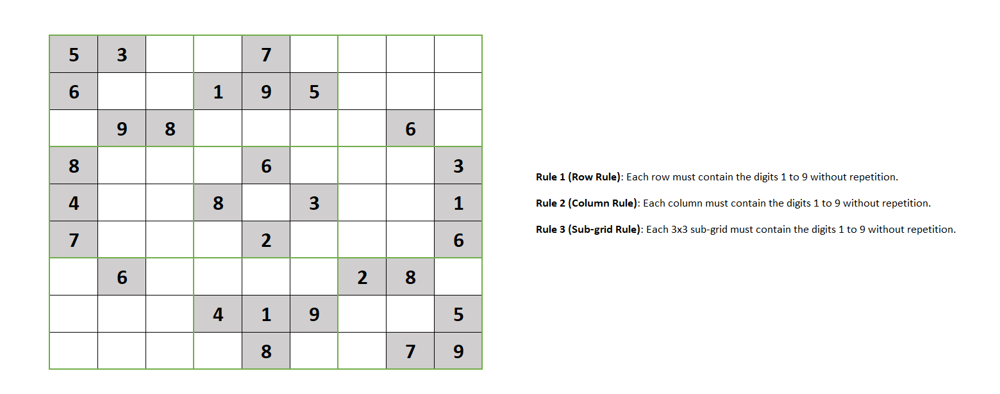

# Sudoku Solver

This project implements a Sudoku solver with both a command-line interface and a graphical user interface (GUI) using GTK+3. The solver can handle Sudoku puzzles of sizes 4x4, 9x9, 16x16, and 25x25.

## NOTE FOR CONTRIBUTORS
If you are a beginner, don't worry. You have already been provided with a basic project structure. Your task now is to manage everything, and you are allowed to modify the structure as needed.

## Table of Contents

- [Features](#features)
- [Installation](#installation)
- [Usage](#usage)
- [File Structure](#file-structure)
- [How It Works](#how-it-works)


## Features

- Solves Sudoku puzzles of various sizes (4x4, 9x9, 16x16, 25x25)
- Command-line interface for quick solving
- Graphical user interface for interactive solving
- Displays the solved Sudoku grid
- Shows the total number of steps taken to solve the puzzle
- Classifies puzzle difficulty based on clues and solving steps

## Simple Sudoku


## Installation

### Prerequisites

- GCC compiler
- GTK+3 development libraries


## Installing Dependencies

### Windows
1. Install MSYS2 from https://www.msys2.org/
2. Open MSYS2 terminal and run:
   ```bash
   pacman -S mingw-w64-x86_64-gtk3 mingw-w64-x86_64-gcc
3. Go to repository directory


### Linux (Ubuntu/Debian)
```bash
sudo apt-get update
sudo apt-get install libgtk-3-dev gcc 
```
Go to repository directory

### macOS
1. Install Homebrew from https://brew.sh/
2. Run:
   ```bash
   brew install gtk+3

Go to repository directory

## Compilation
- Compile the program using the provided Makefile:
  ```bash
  make clear
  make

- This will create an executable named sudoku_solver.

## Usage

### GUI Version
- To run the Sudoku solver with the graphical interface:
#### Windows (MSYS2 MinGW terminal)
   ```bash
   ./sudoku_solver.exe
   ```
#### Linux and macOS
   ```bash
   ./sudoku_solver
   ```

### Command-Line Version
- Compile the code using GCC:
  
To run the Sudoku solver:
   ```bash
   ./sudoku_solver
  ```
To run the Sudoku solver Using txt file:
   ```bash
   ./sudoku_solver ./EXAMPLE/puz.txt
  ```

The program initializes a pre-defined Sudoku puzzle and attempts to solve it. Modify the board array in main.c to test different puzzles.

## File Structure
   ```bash
   Sudoku/
   ├── src/
   │   ├── core/
   │   │   ├── sudoku.c
   │   │   └── sudoku.h
   │   └── gui/
   │       ├── main.c
   │       ├── sudoku_gui.c
   │       └── sudoku_gui.h
   ├── main.c
   ├── Makefile
   └── README.md
  ```


## How It Works

- The program can solve Sudoku puzzles using a backtracking algorithm.
- In GUI mode, users can input puzzles interactively and solve them with a button click.
- In command-line mode, puzzles can be input manually or loaded from a file.
- The solver attempts to find empty cells and fill them with valid numbers.
- If a solution is found, it displays the completed board and solving statistics.
- The difficulty of the puzzle is classified based on the number of clues and solving steps.


  
